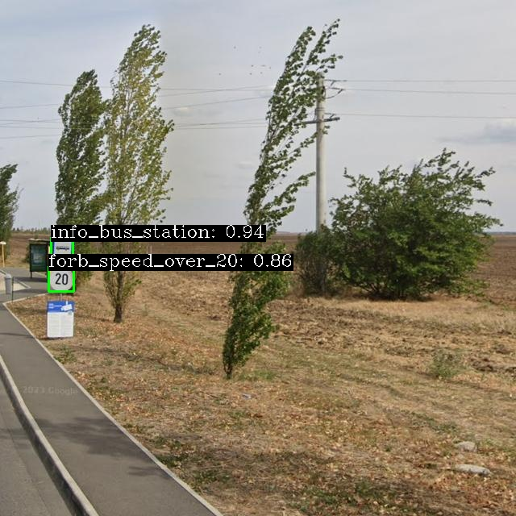

# Street Sign Detection with MLOps



A production-style machine learning project focused on building, training, deploying, and monitoring a road-sign detection system using modern MLOps practices.

This repository demonstrates how to move from a prototype model to a deployable ML service: data versioning, model training, containerization, automated testing, cloud deployment, and production monitoring are all included.

## Project summary

The goal of the project was to build a traffic-sign detection system that can identify road signs from images and serve the model through an API and a visual frontend. The workflow includes:

- data preprocessing and dataset preparation for object detection;
- model training with a YOLO-based detector;
- evaluation and experiment tracking;
- packaging the model for inference;
- exposing it via FastAPI or BentoML services;
- deploying the solution to Google Cloud Run;
- monitoring production data drift and prediction quality;
- automating quality checks with CI/CD and testing.

This project is designed to showcase end-to-end ML engineering skills relevant for data science and MLOps roles.

## Technical stack

- Python and PyTorch
- Ultralytics YOLO for object detection
- FastAPI for inference API
- BentoML for a production-oriented model serving layer
- Streamlit for a simple frontend
- Hydra for configuration management
- Weights & Biases for experiment tracking
- DVC for data/model versioning
- Google Cloud Storage and Cloud Run for deployment
- Evidently for data drift monitoring
- pytest, ruff, mypy, pre-commit, and GitHub Actions for quality assurance
- Docker for reproducible deployment

## What was implemented

### 1. Data pipeline

The project includes a complete preprocessing pipeline for the raw street-sign dataset. This covers:

- loading and validating raw data;
- remapping labels from two different datasets to a canonical class set;
- preparing YOLO-ready dataset files;
- splitting train/validation data;
- versioning the dataset through DVC.

### 2. Model development

A YOLO-based object detection model was trained and evaluated on the prepared dataset. The repository includes:

- model wrapper logic for training and inference;
- configuration-driven experiments;
- hyperparameter experimentation and comparison;
- model artifacts stored and managed as versioned outputs.

### 3. Model serving

The trained model is exposed through deployable interfaces:

- FastAPI inference service for image uploads and prediction results;
- BentoML service for a more specialized ML deployment pattern;
- Streamlit frontend for interactive user access and demo usage.

### 4. Cloud deployment

The project includes deployment logic for Google Cloud Run and associated infrastructure settings, including:

- container builds for API and frontend;
- deployment automation through GitHub Actions;
- environment configuration for cloud services;
- artifact registry and runtime setup for serving the application.

## Architecture overview

```text
Raw dataset
   ↓
Data preprocessing / labeling pipeline
   ↓
DVC-managed datasets and configs
   ↓
YOLO training and evaluation
   ↓
Validated model artifact
   ↓
FastAPI / BentoML serving layer
   ↓
Streamlit frontend + Cloud Run deployment
   ↓
Monitoring / drift detection / production logging
```

## Repository structure

```text
MLOPSStreetSignClassification/
├── .github/                 # CI/CD workflows
├── configs/                 # Hydra configuration and experiment settings
├── data/                    # raw and preprocessed datasets
├── dockerfiles/             # Docker image definitions
├── docs/                    # project documentation
├── models/                  # trained model artifacts
├── notebooks/               # exploratory work
├── outputs/                 # training outputs and runs
├── reports/                 # project summary and reporting files
├── scripts/                 # deployment scripts
├── src/street_sign_project/ # application source code
├── tests/                   # unit, API, and performance tests
├── API_uploads/             # uploaded images and generated outputs
├── pyproject.toml           # dependency and tool configuration
├── README.md                # project overview
├── tasks.py                 # project commands
├── uv.lock                  # locked dependency versions
├── LICENSE
└── AGENTS.md                # repository workflow guidance
```

## Skills demonstrated

This project highlights a broad set of practical capabilities:

- machine learning pipeline development;
- object detection with YOLO;
- reproducible project setup with Python tooling;
- version control and structured collaboration;
- cloud deployment and service architecture;
- REST API development for ML inference;
- monitoring and anomaly detection in production ML;
- software quality practices and automation.

These are exactly the kinds of skills that are valuable in data science, ML engineering, and MLOps roles.

## Local setup

```bash
git clone [<repo-url>](https://github.com/JannisFinnSchmidt/Street-Sign-Detection)
cd MLOPSStreetSignClassification
uv sync --dev --locked
uv run dvc pull
uv run pytest tests/
uv run invoke --list
```

For project-specific tasks, the repo uses `invoke` commands to manage training, deployment, and local serving workflows. The detailed operational notes are maintained in the project documentation and task definitions.

## Documentation and reporting

For a deeper technical description, see the project docs and report files:

- [docs/source/index.md](docs/source/index.md)
- [docs/source/getting_started.md](docs/source/getting_started.md)
- [reports/README.md](reports/README.md)

## Final note

This project was built as a hands-on MLOps case based on the [MLOps course](https://skaftenicki.github.io/dtu_mlops/latest/) offered by the DTU
